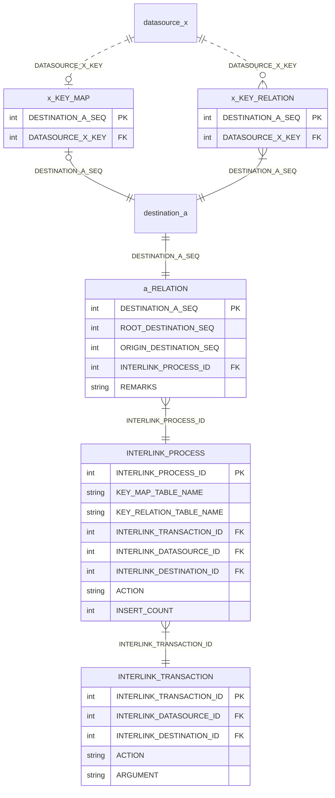

# SRM
SRM is System Relation Mapping Framework.

## ER
The ER diagram showing the whole picture is shown below.
The diagram below is for conceptual purposes only and may differ slightly from the physical name.

### datasource_x
"datasource_x" is the source table, query, or view. This is called a datasource. The primary key is DATASOURCE_X_KEY. There are no restrictions on the type of primary key. Composite keys are also supported.

### destination_a
"destination_a" is the destination table. This is called a dstination. The primary key is DESTINATION_A_SEQ. Primary key must be a sequence.

### x_KEY_MAP, x_KEY_RELATION
"x_KEY_MAP" and "x_KEY_RELATION" are the primary key conversion tables for datasource and destination. Typically, there is a one-to-one relationship between datasource and destination. However, if there is a correction, the data will be transferred with its sign reversed. Therefore, it may be transferred multiple times. x_KEY_RELATION stores the key conversion table for all transfers, and x_KEY_MAP stores only the last key conversion table.

### a_RELATION
"a_RELATION" stores relation information within destination. Normally, there is one line for the destination, but if sign-reversal transfer occurs due to correction, there will be N lines. The original ID is recorded in ROOT_DESTINATION_A_SEQ. ORIGIN_DESTINATION_A_SEQ records the ID that is the source of sign inversion.

### INTERLINK_PROCESS
INTERLINK_PROCESS indicates the transfer process. It has the transfer source, transfer destination, action name, number of added items, and table name of the key conversion table.

NOTE: Regarding the reason for having key conversion assertions. The relationship between datasource and destination is N:1. To support multiple datasources, a key conversion table is required for each datasource. To reversely look up datasource from destination, you need to perform an outer join with all key conversion tables. This is not realistic. Therefore, we use INTERLINK_PROCESS to manage the table name itself, which tells us which key conversion table to refer to.

### INTERLINK_TRANSACTION
INTERLINK_TRANSACTION, as the name suggests, indicates a transaction.
